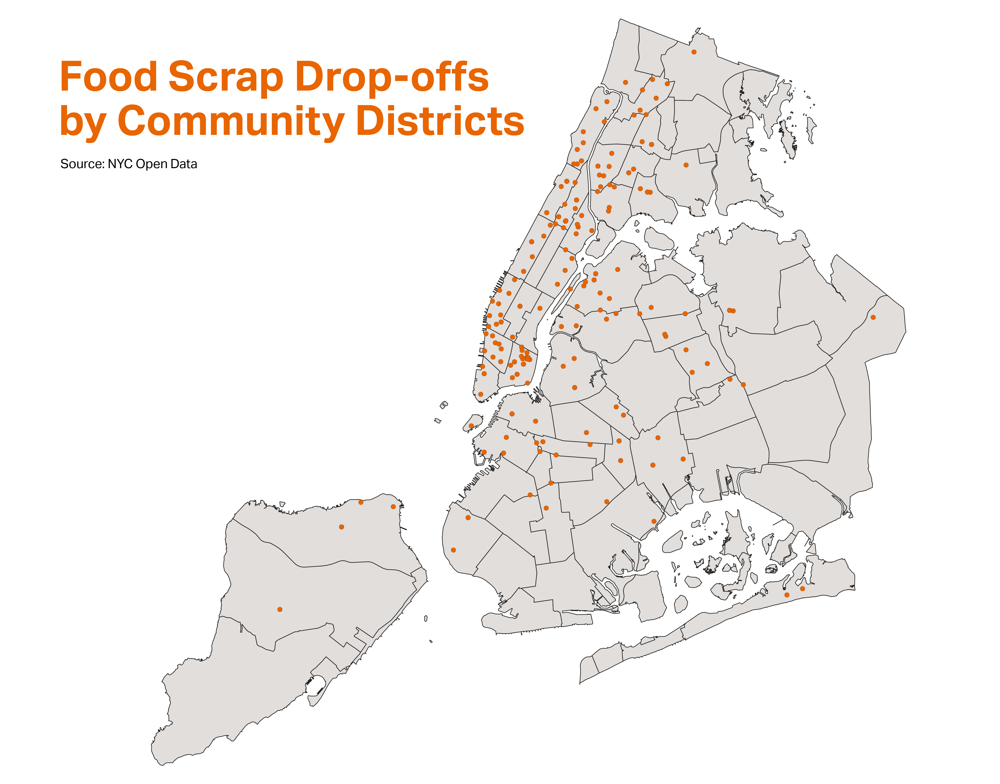

# Mapping
A few mapping experiments looking at waste-adjacent datasets (documented in the Data Library)

## Resources

**Mapbox**

+ [Medium: How to build a “scrollytelling” map](https://blog.mapbox.com/how-to-build-a-scrollytelling-map-ead6baf2cd1b)
+ [Mapbox Demo: Scrollytelling with Mapbox Example](https://demos.mapbox.com/scrollytelling/)
+ [Mapbox Docs: Fly to a location based on scroll position](https://docs.mapbox.com/mapbox-gl-js/example/scroll-fly-to/)
+ [Mapbox: Interactive Storytelling Template](https://www.mapbox.com/solutions/interactive-storytelling)

**Research Institutions**

+ [Columbia Center For Spatial Research](https://c4sr.columbia.edu/tutorials)

## Experiment: August 18, 2020 -- QGIS + Adobe Illustrator (RK)

A very quick map produced from NYC Open Data on food scrap drop-off sites:

**Ways to continue to improve this map and the related datasets:**

Easy to imagine how it may be made more interesting with added context, annotations, additional datasets, etc.

* Add in elected officials to the geographic dataset, export as geojson
* Add column to capture status (open / closed) to Food Scrap Drop-offs dataset (especially given new conditions post-COVID)
* Annotate the map with relevant council members, interactive version could do this by tooltip.

## Experiment: August 25, 2020 -- Mapbox (MM)

By modifying Mapbox's Interactive Storytelling boilerplate, Mapbox studio, and NYC Open Data a basic scrollytelling infographic was created. It uses and compares NYC community district data, pre covid-19 NYC brown bin compost drop-off locations across multiple map visualizations to create a template for possible future use of this style for investigating and informing people about NYC waste.

To try the storytelling map out: clone this repo and navigate to the cg_storytelling folder. From there start a localhost and give it a try!

Here are a few screenshots of the maps and accompanying text:

## Experiment: August 27, 2020 -- QGIS, Census/ACS Data Research

A non-interactive rendering of how we might layer different geographic boundaries on top of each other to highlight different layers of information.

### About Geographic Data -- Sources & Related Writings

+ [Zipcode shapefile](https://data.cityofnewyork.us/Business/Zip-Code-Boundaries/i8iw-xf4u/data?no_mobile=true) -- the shape file contains population counts attributed to USPS. Does not seem accurate for all zip codes (e.g. count for 11359 noted as 0)

+ [Difference between a zipcode and Zip Code Tabulation Area (ZCTA)](https://www.census.gov/programs-surveys/geography/guidance/geo-areas/zctas.html)
	+ "ZIP Code Tabulation Areas (ZCTAs) are generalized areal representations of United States Postal Service (USPS) ZIP Code service areas. The USPS ZIP Codes identify the individual post office or metropolitan area delivery station associated with mailing addresses. USPS ZIP Codes are not areal features but a collection of mail delivery routes."
	+ **"In most instances the ZCTA code is the same as the ZIP Code for an area."**
	+ Most granular information is available by census block, but zip codes are more user-friendly.
+ We are able to download robust population  estimates broken down my demographics from the Census website ([example here](https://data.census.gov/cedsci/table?q=United%20States&g=8600000US10001,10002,10003,10004,10005,10006,10007,10009,10010,10011,10012,10013,10014,10016,10017,10018,10019,10020,10021,10022,10023,10024,10025,10026,10027,10028,10029,10030,10031,10032,10033,10034,10035,10036,10037,10038,10039,10040,10044,10065,10115,10119,10128,10154,10278,10280,10301,10302,10303,10304,10305,10306,10307,10309,10310,10312,10314,10451,10452,10453,10454,10455,10456,10457,10458,10459,10460,10461,10462,10463,10464,10465,10466,10467,10468,10469,10471,10472,10473,10474,10475,10514,10543,10553,10573,10701,10705,10911,10965,10977,11001,11021,11050,11101,11102,11103,11104,11105,11106&tid=ACSDP5Y2018.DP05&tp=true&hidePreview=true)).
	+ ACS 5-year Estimate as of 2018
	+ [Technical Documentation here](https://www.census.gov/programs-surveys/acs/technical-documentation/code-lists.html)
	+ I love that they report their **margin of error**!  

### About Geographic Data -- Conclusions & Findings:

+ Most granular information is available by census block, but zip codes are more user-friendly. **ZCTA match pretty well with zipcodes** -- based on the above report by the Census Bureau.

## Experiment: September, 9 2020 -- QGIS  (MM)

Using [this](https://www.youtube.com/watch?v=f-vTthza2fQ) advanced geoprocessing tutorial as a framework,
I created a map of the NYC census tracts with their percentages of land area within a quarter mile of brown bin drop offs.

**Datasets Used:**
+ [NYC Brown Bin Drop Off Locations](https://data.cityofnewyork.us/Environment/Food-Scrap-Drop-Off-Locations-in-NYC/if26-z6xq)
+ [2010 NYC Census Tracts](https://data.cityofnewyork.us/City-Government/2010-Census-Tracts/fxpq-c8ku)

**Maps**

This first map shows the intersection of buffers created around each brown bin drop off and the census tracts within a quarter mile of each bin.

This map is the final output from the geopressing. It shows all NYC census tracts with their percentages of land area within a quarter mile of brown bin drop offs. The gradient is from white to dark purple, with dark purple indicating the most density of census tracts within the quarter mile of the drop off point.

**NOTE**

There seemed to be a scaling error with a few of the census tract area calculations. I will update the maps with a proper legend as soon as the error is found.
